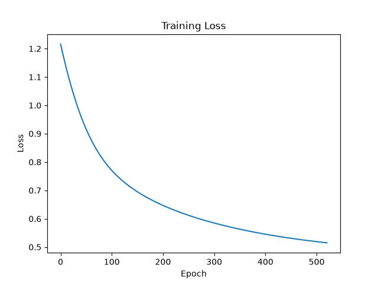
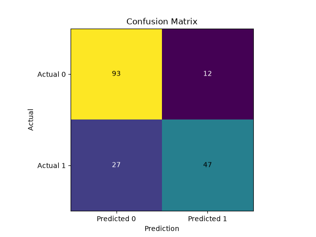

# Neural Network From Scratch

A binary classification neural network implemented from scratch using Python and NumPy. The project uses the Titanic dataset to predict whether a passenger survived based on selected passenger information.

The goal of this project was to understand how a neural network works internally rather than relying on a machine learning framework to handle the implementation.

## Overview

The neural network is built from scratch and includes:

- Forward propagation
- Backpropagation
- Gradient descent
- ReLU activation
- Sigmoid activation
- Binary cross-entropy loss
- He weight initialization
- Early stopping
- Classification thresholding
- Confusion matrix evaluation
- Accuracy, precision, recall and F1 score

The project uses NumPy for the neural network calculations and scikit-learn only for splitting the dataset into training and testing sets.

## Dataset

The model uses four features from the Titanic dataset:

- `Pclass`
- `Sex`
- `Age`
- `Fare`

Preprocessing includes:

- Converting `Sex` into a numerical value
- Filling missing `Age` values using the median
- Splitting the data into 80% training and 20% testing data
- Standardising the features using statistics calculated from the training data

## Neural Network Architecture

```text
Input Layer
4 features
    ↓
Hidden Layer
10 neurons
ReLU activation
    ↓
Output Layer
1 neuron
Sigmoid activation
```
## Model Configuration

- Input features: 4
- Hidden neurons: 10
- Hidden activation: ReLU
- Output activation: Sigmoid
- Learning rate: 0.01
- Maximum epochs: 1000
- Weight initialization: He initialization
- Early stopping: Enabled
- Classification threshold: 0.5

## Evaluation

The model is evaluated using:

- Accuracy
- Precision
- Recall
- F1 Score
- Confusion Matrix

### Results

| Metric | Score |
|---|---:|
| Accuracy | 78.21% |
| Precision | 79.66% |
| Recall | 63.51% |
| F1 Score | 70.68% |



### Confusion Matrix

| | Predicted 0 | Predicted 1 |
|---|---:|---:|
| Actual 0 | TN | FP |
| Actual 1 | FN | TP |



## Experiments

Several experiments were carried out during development to understand how different parts of the neural network affect training and evaluation.

### Weight Initialization

The network initially used randomly generated weights. He initialization was then implemented to provide a more suitable starting point for the weights in the ReLU hidden layer.

This helped demonstrate how the choice of weight initialization can affect the starting loss and training behaviour.

### Early Stopping

Early stopping was implemented using a tolerance value to detect when the loss was no longer improving significantly.

Rather than always training for all 1000 epochs, the network stops when the improvement in loss remains below the tolerance for a specified number of iterations.

### Classification Threshold

The default classification threshold was set to `0.5`.

Different thresholds were tested to understand the relationship between precision and recall. Lowering the threshold resulted in more positive predictions, increasing recall while generally reducing precision.

This demonstrated the trade-off involved when selecting a classification threshold.

### Evaluation Metrics

Accuracy, precision, recall and F1 score were implemented from scratch rather than using pre-built metric functions.

A confusion matrix was also implemented to calculate:

- True Positives (TP)
- False Positives (FP)
- False Negatives (FN)
- True Negatives (TN)

These values were then used to calculate the classification metrics.

## Project Structure

```text
Neural_Network_From_Scratch/
├── notebooks/
│   └── experiments.ipynb
├── results/
│   ├── confusion_matrix.png
│   └── training_loss.png
├── src/
│   ├── models/
│   │   ├── activations.py
│   │   ├── loss.py
│   │   └── neural_network.py
│   ├── utils/
│   │   ├── metrics.py
│   │   └── preprocessing.py
│   ├── main.py
│   └── train.py
├── .gitignore
├── README.md
└── requirements.txt
```

## Installation

Clone the repository:

```bash
git clone https://github.com/YoussefEl-Guoshi18/Neural_Network_From_Scratch.git
cd Neural_Network_From_Scratch
```

Install the required dependencies:

```bash
pip install -r requirements.txt
```

## Usage

Place the Titanic `train.csv` dataset inside:

```text
data/train.csv
```

Then run the training script:

```bash
cd src
python train.py
```

## What I Learned

This project helped me develop a deeper understanding of how neural networks work internally, including:

- How forward propagation generates predictions
- How backpropagation calculates gradients
- How gradient descent updates weights and biases
- How activation functions affect the network
- Why feature scaling is important
- How weight initialization affects training
- How binary cross-entropy measures classification error
- How precision and recall change with the classification threshold
- How confusion matrices can be used to evaluate classification performance